# Group Me Data Analysis - Private Edition
A deep dive into 5 years of conversations

- Goal: the end goal is to better understand the users and their standings among each other

## The Dataset
The dataset is massive json object consisting of over 21 thousand messages. Each row corresponds to one message sent.

##### Features

`attatchements` - A list of strings where each string is the url of an attatchment or an empty list if there are none

`avatar_url` - A string of the url for the avatar 

`created_At` - YYYY-MM-DD HH:MM:SS timestamp

`favorited_by` - A list of strings where each string is the `sender_id` of the user who liked the message

`group_id` - A unique integer that is the unique ID of the GroupMe

`id` - A uniqie integer that is the unique ID of a message

`name` - The name as a string of the user who sent the message

`sender_id` - A unique integer that is the unique ID of a user

`sender_type` - 'user', 'system', or 'bot'

`source_guid` - An id of some sort 

`system` - A boolean value, wether a message was sent by the system or not

`text` - The content of the message represented as a string

`event` - A list json objects which are the events of a message. Examples: Mentions, Adding/removing, etc.

##### Features Added
Features created for convenience and modeling

`true_name` - A string representing the unique name of a person. Mapped from sender_id. `name` changes, `true_name` does not.

`year_month` - YYYY:MM timestamp when the message was created

`year` - YYYY timestamp when the message was created 

`in_chat` - A list of strings where each string is the `true_name` of a user currently in the chat

`num_active` - An integer of the number of active users in the chat

`like_count` - An integer of the number of likes

### Messages Sent
An analysis on the number of messages sent

Let's get a basic view of the number of messages sent over time.

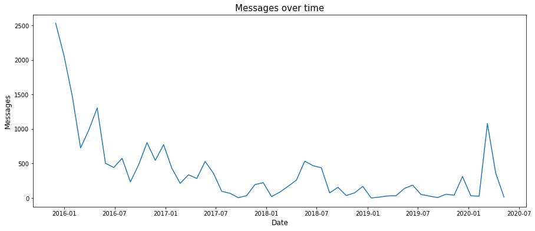
`fig 1: Total number of messages for each 'year_month' i.e. month`

We can see clear downward trend with spikes during summer and winter, along with a massive spike during the outbreak of covid

Let's plot this with users as well to see if any users go against the trends

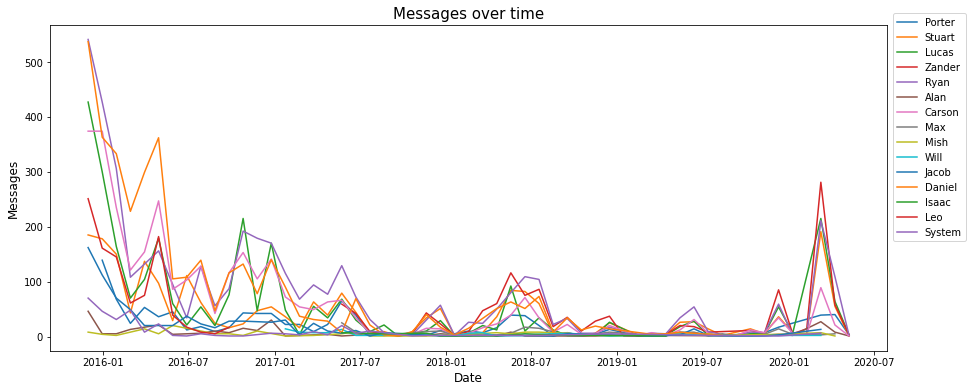
`fig 2: Total number of messages for each 'year_month' split by user`

It looks like everyone follows the trends equaly - conformity makes sense as most people message in response to other people.

Though, there is a clear surge of red during later dates of the group chat, and some users seem to just dissappear. We will take a closer look at this with rankings later. For now, let's break things down per user. Let's see the total number of messages

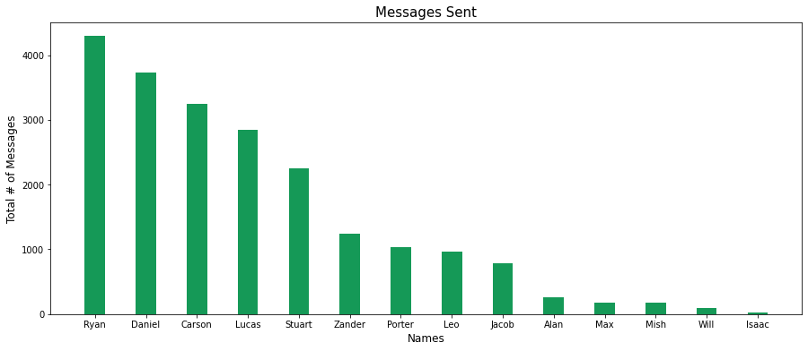
`fig 3: A count of the total messages per 'true_name'`

Some clear leaders here. Let's factor in time - maybe some have just been there longer. 

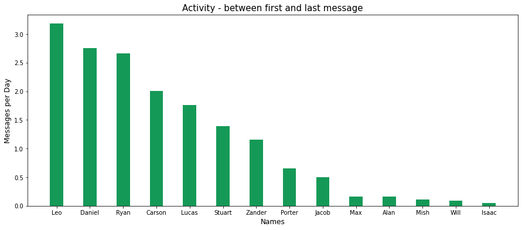
`fig 4: A count of the number of messages sent over time 'true_name' was in the group`

This is biased in a different way - Leo was around during the time when the most messages were sent so obviously he would have the highest rate. It looks like measuring by time is not reliable. A better measurement would be percent of messages sent while the user was active in the GroupMe. 

We take the slice of messsages in between a users first and last message and calculate the percent of those messages that are theirs.

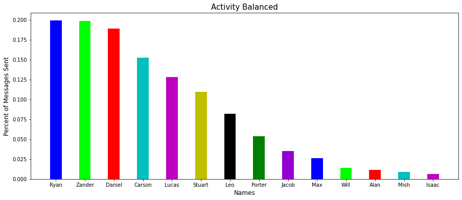
`fig 5: A proportion of messages sent by 'true_name' between their first and last message`

Leo does not look so active anymore. Let's take a look and pure rankings of messages sent to confirm this shift. 

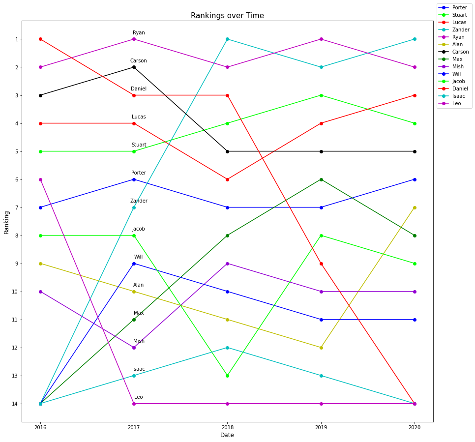
`fig 6: The ranking of 'true_name' of messages sent during the year`

The rankings confirm that Zander, despite having a low message per day rate, is currently the most active member. For Leo, the opposite is true. 

### Likes
First, let's look at the messages. Do liked messages follow any kind of distribution?

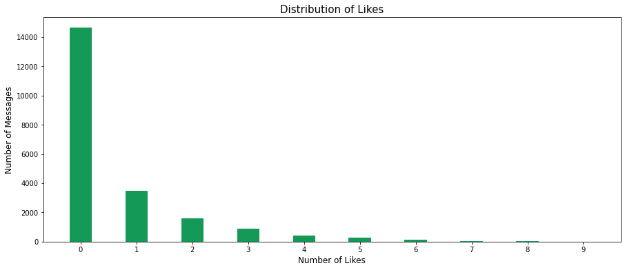
`fig 7: The number of messages with 'like_count' values`

Logarithmic for sure. The likelihood of getting more likes clearly decreases with each desired like. 

Let's take a peek at the most liked messages. 

| Message        | Image           | Likes  | Sender |
| ------------- |:-------------:| -----:| -----:|
| We love you man, hang in there    | N/A | 9 | Carson |
| @Carson you look handsome in that yearbook pic      | N/A  | 9 | Jacob |
| I'm a yellow jacket now |  N/A  |  9 | Porter |
|tfw ||9|Daniel|
|Spotted at Lenox| https://v.groupme.com/18315642/2019-05-05T18:43:21Z/1edbc4b.568x320r90.mp4 |9|Porter|
|Cunts| | 8 |Stuart|

Mostly wholesome. 

#### Likes Received 
Let's look at likes in relation to users. First the cummulative totals 

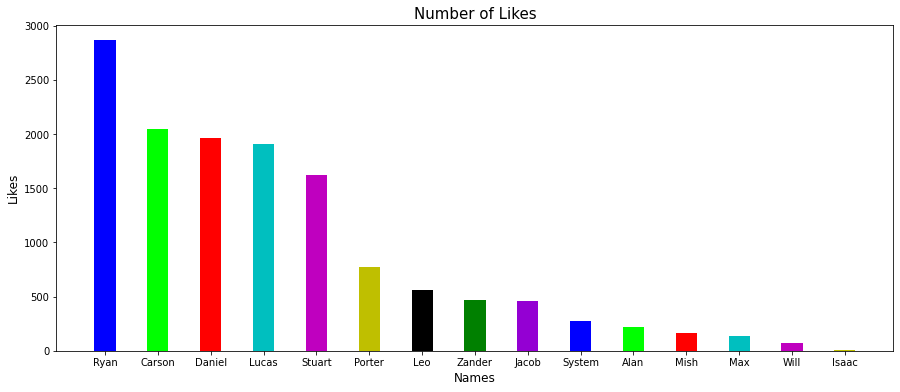
`fig 8: Value counts of 'like_count' per 'true_name'`

Almost the exact same as total messages sent. How many likes are in each users liked messages?

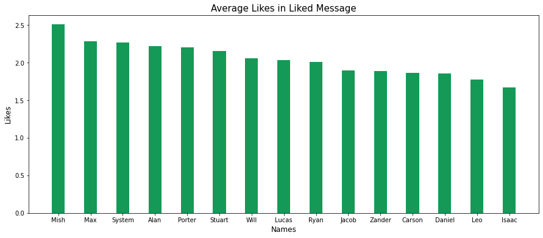
`fig 9: The mean of 'like_count' for every message by 'true_name' with a like`

Pretty boring - not too many outliers here. 

Let's see the average likes a user gets for messages in general(during that users active time)

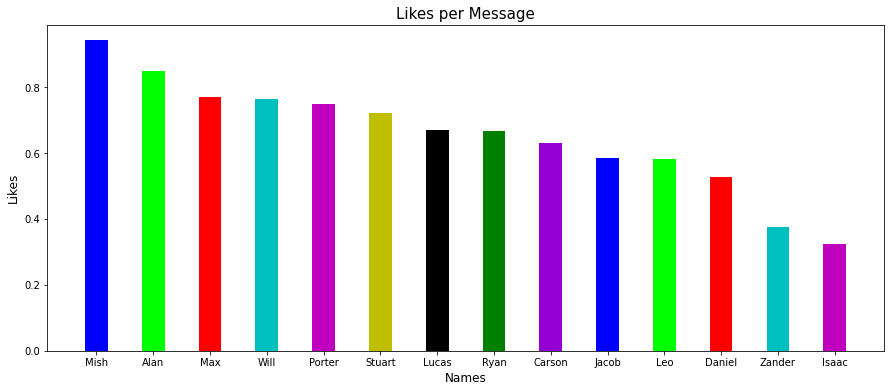
`fig 10: The mean of 'like_count' for every message by 'true_name'`

It looks like a reversal of the total messages sent graph with the notable exceptions of Isaac and Zander who have much lower rates than expected.

Why is Zander's likes per message so low? Is he just sending bad messages? One explanation could be that the rate of liking has decresed over time. Let's take a look.

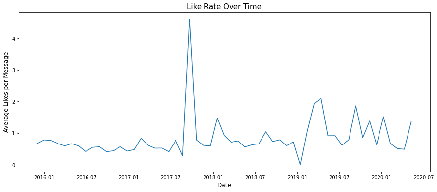
`fig 11: The mean likes for a message during a 30 day time period`

Nope, the like rate increased - looks like Zander's messages per likes should actually be lowered to account for the increased like rate.

What happened in October 2017? We see a massive spike in average likes. Turns out, there are only 5 messages during that 30 day period:

| Message        | Image           | Likes  | Sender |
| ------------- |:-------------:| -----:| -----:|
| @Lucas    |  | 7 | Stuart |
| It's COCKtober 🍆🎃 u know what that means 👀👅 Dick sucking awareness month 😯🙆🏼👅 send this to 12 of ur closet hoes 👭😈 that love that dick 🍆🍆🍆💦💦💦 🎃🎃🎃🎃🎃 🎃 🎃 🎃 🎃 🎃 🎃 🎃 🎃 🎃 🎃 🎃 🎃 🎃🎃🎃🎃🎃 🎃 🎃 🎃 🎃 🎃 🎃 🎃🎃🎃🎃 🎃 🎃 🎃 🎃 🎃 🎃 🎃 🎃 🎃 🎃 🎃🎃🎃🎃 🎃🎃🎃🎃🎃 🎃 🎃 🎃 🎃 🎃 🎃 THOT-O-WEEN 🎃is upon us !! If you get this message ✉️ you are queen 👸of the thots!!! Forward this to 7⃣ of the 🍆ThOtTiEsT🍆 thots 💁that you know will get some 👉👌 soon !!! If you don't, be prepared 🙍for 6⃣9⃣ days of bad luck ⚠️ 🍀	    | N/A  | 4 | Ryan |
| The fact that all those jack-o-lanterns aren't all aligned is upsetting |  N/A  |  4 | Daniel |
| why the fuck | N/A | 0 | Zander |
|N/A|  | 8 | Lucas |

Looks like the only message without likes is Zanders.

#### Likes Given
What about the likes that users give?

We start with the total number of likes given.

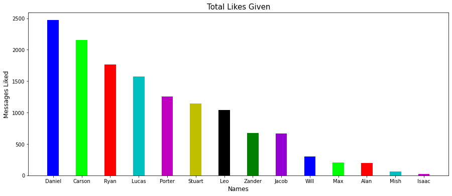
`fig 12: Value counts of the number of times 'true_name' appeared in 'favorited_by'`

Let's control for active time of a user.

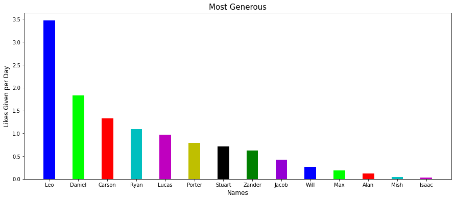
`fig 13: Value counts of the number of times 'true_name' appeared in 'favorited_by' divided by time between first and last message` 

Again, time does not seem to be the best balancing factor. Let's try it with messages as well.

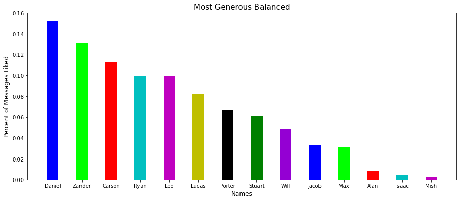
`fig 14: Value counts of the number of times 'true_name' appeared in 'favorited_by' divided by total number of messages in active time frame not sent by 'true_name'`

Much better. Let's take a look at the rankings per year to see the mobility. 

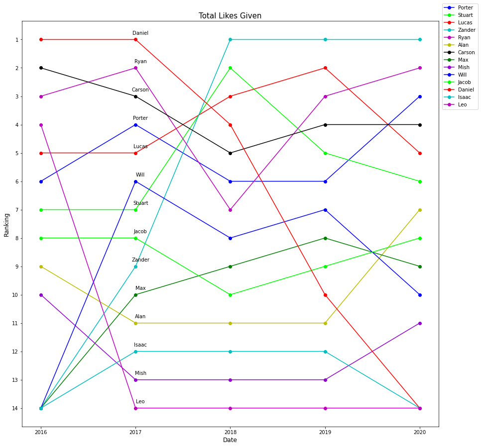
`fig 15: The ranking of each 'true_name' via percentage of messages liked`

There appears to be a large shift after the end of highschool. 

#### Like Similarity
Which users have similar tastes?

Similarity of likes is fairly difficult to measure. We first create 14 new attributes, one for each user, where each one is a binary 0, 1 value of not-like to like. 

We then need to do cross similarity for all the binary vectors for each user. Though, the vast majority of elements in a vector are 0, this caused a lot of similarity to those who did not like anything. To fix this, we cut out the double 0 comparisions with each user. 

After the double zero elements are removed we mesaure the Hamming Distance between each vector as our measure of similarity, the results are below:

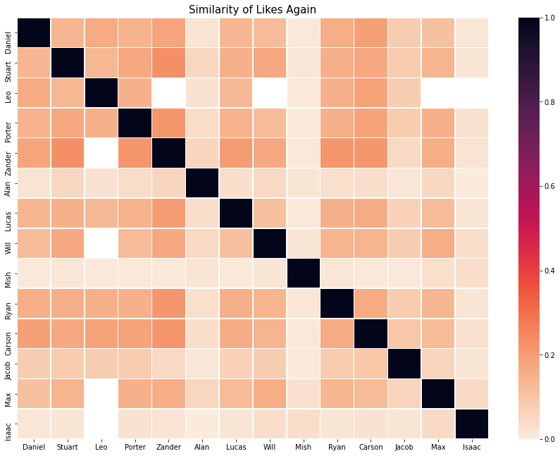 

## More to Come!
- Can we predict the likes a message will get?
- Can we make a bot talk like Ryan?
- Much more!
